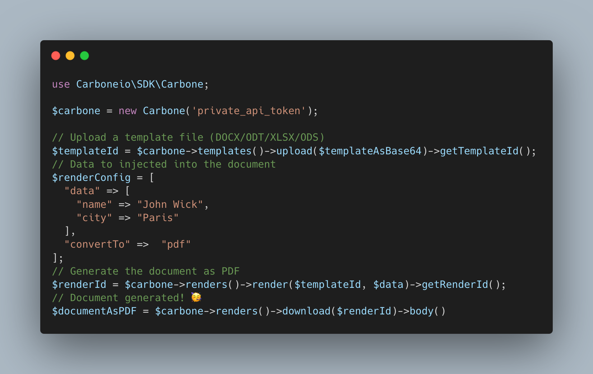

# Carbone PHP SDK

This package provides a PHP SDK for the [Carbone.io](https://carbone.io) Cloud API.



## About Carbone

Carbone is a powerful and easy to use API to generate documents from a template to a PDF. It is based on LibreOffice and can convert any document supported by LibreOffice. It is also possible to convert HTML to PDF. Learn more about [supported files and features](https://carbone.io/documentation.html#supported-files-and-features-list).

## Installation

You can install the bindings via [Composer](http://getcomposer.org/). Run the following command:

```bash
composer require carboneio/carbone-sdk-php
```

## Usage

### Carbone instance

Using the SDK is very easy. You just need to create a new instance of the Carbone class and provide your API key. Get your API key on your Carbone account: https://account.carbone.io/.

```php
use Carboneio\SDK\Carbone;

$carbone = new Carbone('YOUR_API_KEY');
```

### Upload a template

You can upload a template to Carbone using the `upload` method. This method takes the content of the template as base64. The method returns a `template ID` used to [generate documents](#render-a-template).

```php
$response = $carbone->templates()->upload($contentBase64);

$templateId = $response->getTemplateId();
```

Example to [upload a template](./examples/upload_template.php)

### Render a template

You can generate a document using the `render` method. This method takes the `template Id` and the data as parameters. A `render ID` is returned and must be used to [download the generated document](#download-a-rendered-template).

```php
$response = $carbone->renders()->render($templateId, $data);

$renderId = $response->getRenderId();
```
Example to [render a template](./examples/render_report.php)

### Download a rendered template

You can download a rendered template using the `download` method. This method takes the `render ID` as a parameter.

```php
$response = $carbone->renders()->download($renderId);

// Save the contents of the file yourself on your filesystem
$content = $response->getContent();
```
Example to [download a rendered document](./examples/download_report.php)

### Delete a template

You can delete a template using the `delete` method. This method takes the `template Id` as a parameter.

```php
$response = $carbone->templates()->delete($templateId);
```

Example to [delete a template](./examples/delete_template.php)

### Download a template

You can download a template using the `download` method. This method takes the `template Id` as a parameter.

```php
$response = $carbone->templates()->download($templateId);
```
Example to [download a template](./examples/download_template.php)

### Add custom headers

Set custom headers, such as "carbone-version" to select a specific [Carbone version](https://carbone.io/api-reference.html#api-version). By default, the SDK request the version 4 of Carbone.

```php
$carbone->setHeaders([
  "carbone-version" => 4,
  /** Uncomment to delete automatically templates after a specific time */
  // "carbone-template-delete-after" => 86400, // 86400s = 1 day | https://carbone.io/api-reference.html#template-storage
  // "carbone-webhook-url" => "https://my-server", // https://carbone.io/api-reference.html#api-webhook
]);
```

### Get API Status

```php
$response = $carbone->getStatus();
$json = $response->json();

echo "Status : " . $response->status() . "\n";
echo "Success: " . $json['success'] . "\n";
echo "Version: " . $json['version'] . "\n";
echo "Message: " . $json['message'] . "\n";
```

## 🧪 Run tests

First install required composer packages:
```bash
composer install
```

Then execute tests:
```bash
composer test
```

## 👤 History

The package was originaly made by [MadeByBob](https://github.com/madebybob) and open-sourced the code. The Carbone.io team is now maintaining the SDK and will bring all futur evolutions.<br>
Original repository:https://github.com/madebybob/carbone-sdk<br>
MadeByBob website: https://madebybob.nl/

## 🤝 Contributing

Contributions, issues and feature requests are welcome!

Feel free to check [issues page](https://github.com/carboneio/carbone-sdk-php/issues).

## Show your support

Give a ⭐️ if this project helped you!